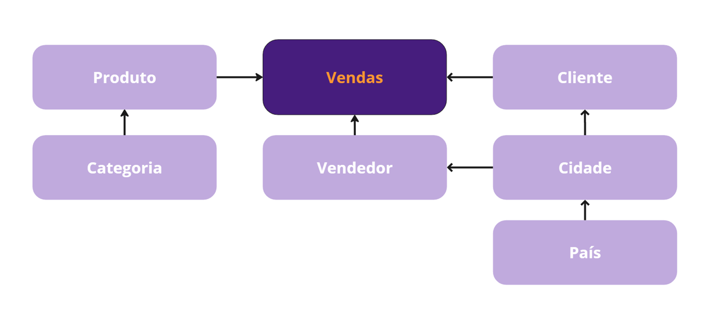

# panex-lakehouse
Projeto de criação de um Data Lakehouse para a empresa fictícia PanEX, seguido de ingestão e transformação de dados.  Desenvolvido durante o Bootcamp de Engenharia de Dados Data Women Engineers 2025, promovido pela DataEX.

## Estrutura de Dados
A estrutura trata-se de um banco relacional simples de registros de vendas da empresa PanEX. O banco está estuturado em modelagem dimensional no formato Snowflake e conta como tabela fato os registros de vendas relacionado às dimensões produtos, categoria, país, cidade, cliente e vendedor.

## Repositório LakeHouse
O uso de repositório lakehouse garante que teremos versões de dados em camadas da estrutura Medallion, apoiadas na governança de oferecer flexibilidade de uso. Com isso, os registros podem atender a questões de analytics, analise preditiva ou prescritiva. A ingestão foi realizada com o objetivo de garantir acesso performático aos dados, sendo assim, da camada bronze até a camada gold os registros estão armazenados de forma particionada no formato Delta Parquet.

## Mapeamento de Entidades e Estratégias
A ingestão e transformação realizada nos dados foi pensada para que possa haver possibilidade de sobreescrita ou incrementalidade de dados, considerando a atualização do banco fonte. Sendo assim, foi montado um mapa de estratégias para as entidades, considerando suas características no modelo dimensional, tipo de carga suportada nas três camadas e planejamento de periodicidade dessas cargas.

